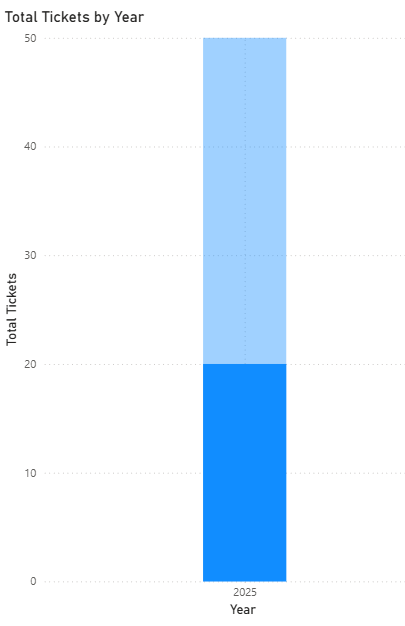
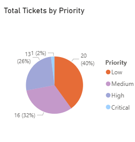
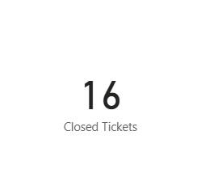
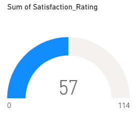

# IT Service Performance Dashboard

##  Project Overview
This Power BI dashboard visualizes the performance of an IT Service Desk.  
It provides insights into ticket volume, priority distribution, closed tickets, and customer satisfaction.

##  Dashboard Components
1. **Monthly Tickets (Column Chart)**:
   
   Shows the total tickets received per month.
2. **Ticket Priority Distribution (Pie Chart)**:
    
   Displays the proportion of tickets by priority (High, Medium, Low).
3. **Closed Tickets (Card Visual)**:
     
   Shows the total number of tickets closed.
4. **Customer Satisfaction Rate (Gauge Visual)**:
    
   Displays the satisfaction rate (%) of service desk users.
 
##  Screenshots
See the `Screenshots/` folder for visual representation of each chart.

##  Files
- `Tickest.pbix` → Power BI project file
- `Screenshots/` → Folder containing images of each visual

##  Tools Used
- Power BI Desktop
